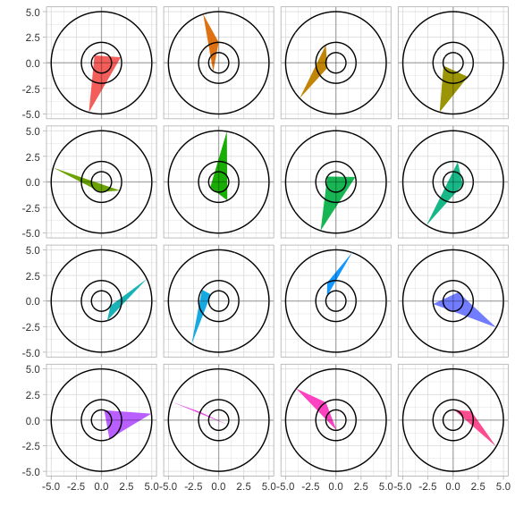
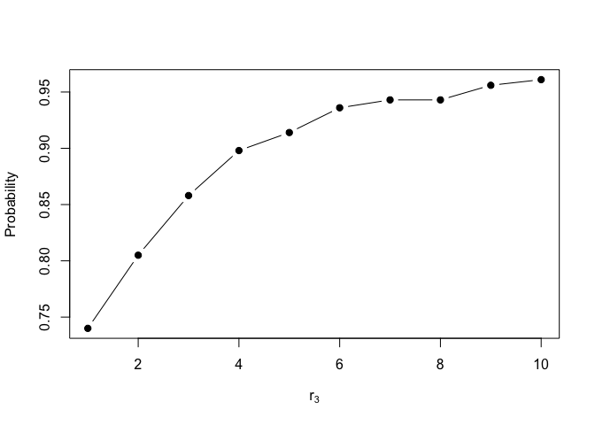

<!-- README.md is generated from README.Rmd. Please edit that file -->

# concentric

What is the probability that a *random triangle* is obtuse? The answer,
depends on how you define a random trinagle. In the most general case,
the answer is \(1/4\). To obtain this answer, one can use the fact that,
for any triangle \(T\), there exists some circle \(C\) such that the
vertices of \(T\) all lie on its circumference. Hence, the problem is
equivalent to finding the probability that the points randomly
distirbuted on the circumference of a circle form an obtuse triangle.

A more challenging problem, inspired by the question above, is the
following. Concider three concenctric circles \(C_1\), \(C_2\), and
\(C_3\) with radii \(r_1\), \(r_2\), and \(r_3\), respectively, and that
\(r_1 < r_2 < r3\). What is the probability that three randomly selected
points, one on each circle, forms an obtuse triagle? In other words,
what is the probability that a random triangle is obtuse if each vertex
must lie on the circumference of a different concentric circle? Some
simulated examples (with \(r_1 = 1\), \(r_2 = 2\), and \(r_3 = 5\)) are
illustrated in the figure
below.



``` r
# Simulate some random triangles
set.seed(101) 
triangles <- simTri(n = 1000L, radii = c(1, 1, 5))

# What proportion are obtuse?
mean(plyr::daply(triangles, .variables = "triangle", isObtuse))
#> [1] 0.901
(4*5 - 1) / (4 * 5)
#> [1] 0.95
```

``` r
props <- sapply(1:10, FUN = function(x) {
  triangles <- simTri(n = 1000, radii = c(1, 1, x))
  mean(plyr::daply(triangles, .variables = "triangle", isObtuse))
})
plot(1:10, props, type = "b", pch = 19,
     xlab = expression(r[3]), ylab = "Probability")
```

<!-- -->
